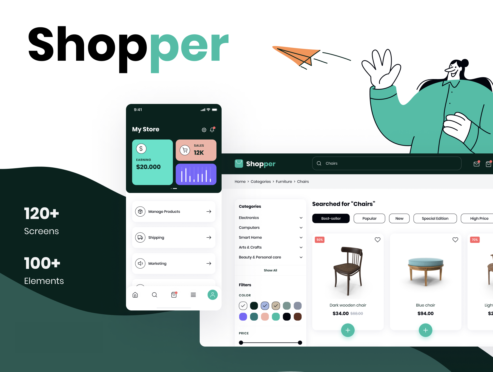
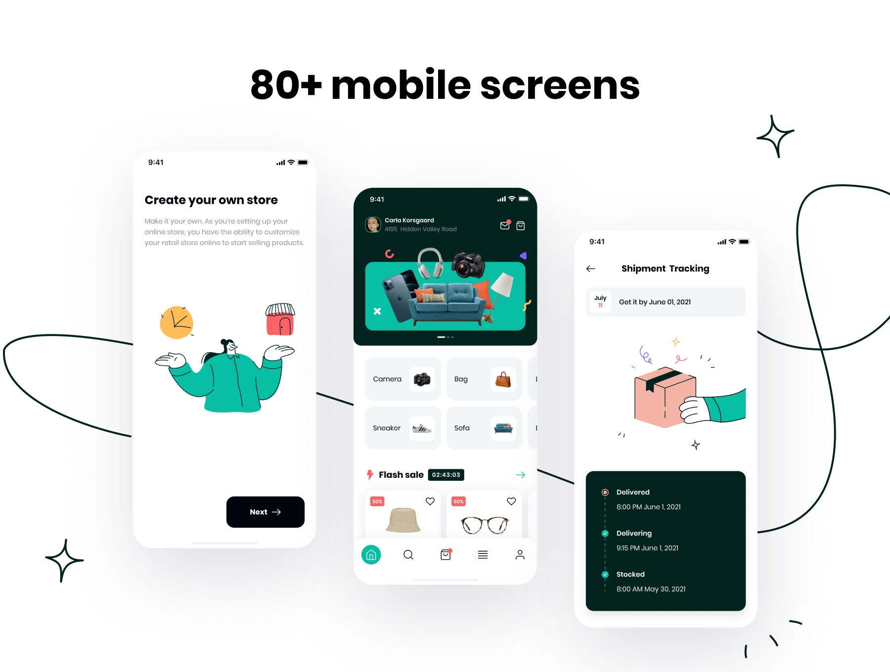
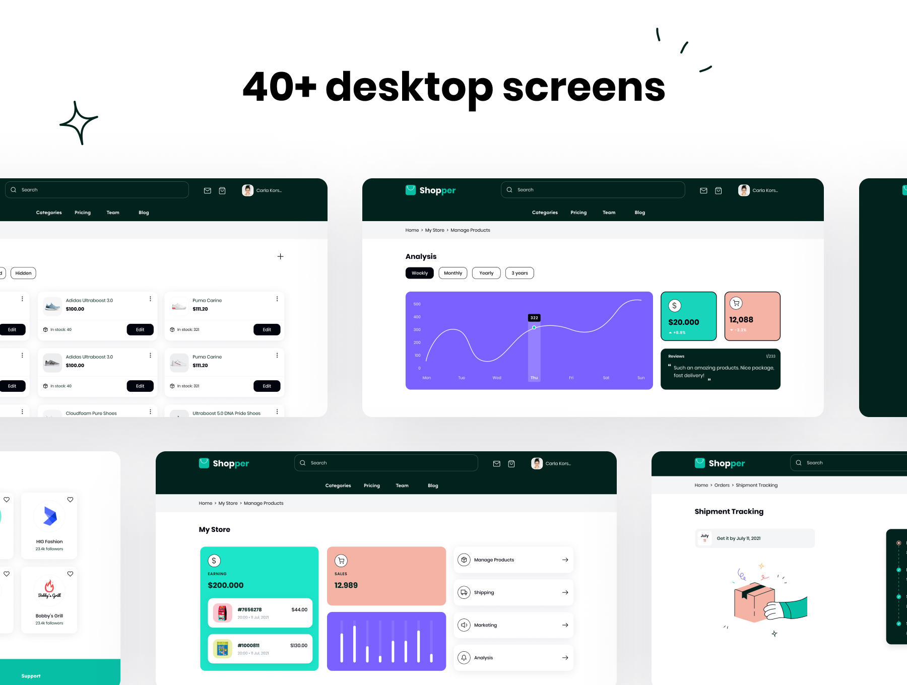

<h1 align="center">
    
</h1>

<h1 align="center">
   🛍️ <a href="#"> Shopper - Ecommerce Mobile App & Website </a>
</h1>

<h3 align="center">
    Shopper is an E-commerce UI kit for both mobile (React Native) and web (Next.js). It will help you creating your own e-commerce application and website with full user flow.
</h3>

<h3 align="center">
    IMPORTANT: Next.js version coming soon!
</h3>

<p align="center">
  

  

  
  
  <a href="https://github.com/raivieiraadriano92/expo-shopper-ecommerce-ui-kit/commits/master">
    
  </a>
    
   

   <a href="https://github.com/raivieiraadriano92/expo-shopper-ecommerce-ui-kit/stargazers">
    
  </a>
</p>

<h4 align="center"> 
	 Status: Development
</h4>

<p align="center">
 <a href="#about">About</a> •
 <a href="#features">Features</a> •
 <a href="#layout">Layout</a> • 
 <a href="#how-it-works">How it works</a> • 
 <a href="#tech-stack">Tech Stack</a> • 
 <a href="#contributors">Contributors</a> • 
 <a href="#author">Author</a> • 
 <a href="#user-content-license">License</a>

</p>

## About

♻️ Shopper - is a way to connect companies and entities that collect organic and inorganic waste to people who need to dispose of their waste in an ecological way.
Project developed during ** NLW - Next Level Week ** offered by [Rocketseat](https://blog.rocketseat.com.br/primeira-next-level-week/). NLW is an online experience with lots of practical content, challenges and hacks where the content is available for a week.

---

## Features

- [x] Companies or entities can register on the web platform by sending:

  - [x] an image of the collection point
  - [x] entity name, email and whatsapp
  - [x] and the address so that it can appear on the map
  - [x] in addition to selecting one or more collection items:
    - lamps
    - Batteries
    - papers and cardboard
    - electronic waste
    - organic waste
    - kitchen oil

- [x] Users have access to the mobile application, where they can:
  - [x] browse the map to see the registered institutions
  - [x] contact the entity via E-mail or WhatsApp

---

## Layout

This project does not contain the design source like the figma file.

### Mobile Preview

<p align="center">
  
</p>

### Web Preview (coming soon!)

<p align="center" style="display: flex; align-items: flex-start; justify-content: center;">
  
</p>

---

## How it works

### Pre-requisites

Before you begin, you will need to have the following tools installed on your machine:
[Git] (https://git-scm.com), [Node.js] (https://nodejs.org/en/).
In addition, it is good to have an editor to work with the code like [VSCode] (https://code.visualstudio.com/)

#### Running the application

```bash

# Clone this repository
$ git clone git@github.com: tgmarinho / README-ecoleta.git

# Access the project folder in your terminal
$ cd README-ecoleta

# Go to the Front End application folder
$ cd web

# Install the dependencies
$ npm install

# Run the application in development mode
$ npm run start

# The application will open on the port: 3000 - go to http://localhost:3000

```

---

## Tech Stack

The following tools were used in the construction of the project:

#### **Website** ([React](https://reactjs.org/) + [TypeScript](https://www.typescriptlang.org/))

- **[React Router Dom](https://github.com/ReactTraining/react-router/tree/master/packages/react-router-dom)**
- **[React Icons](https://react-icons.github.io/react-icons/)**
- **[Axios](https://github.com/axios/axios)**
- **[Leaflet](https://react-leaflet.js.org/en/)**
- **[React Leaflet](https://react-leaflet.js.org/)**
- **[React Dropzone](https://github.com/react-dropzone/react-dropzone)**

> See the file [package.json](https://github.com/raivieiraadriano92/expo-shopper-ecommerce-ui-kit/blob/master/web/package.json)

#### [](https://github.com/tgmarinho/Ecoleta#server-nodejs--typescript)**Server** ([NodeJS](https://nodejs.org/en/) + [TypeScript](https://www.typescriptlang.org/))

- **[Express](https://expressjs.com/)**
- **[CORS](https://expressjs.com/en/resources/middleware/cors.html)**
- **[KnexJS](http://knexjs.org/)**
- **[SQLite](https://github.com/mapbox/node-sqlite3)**
- **[ts-node](https://github.com/TypeStrong/ts-node)**
- **[dotENV](https://github.com/motdotla/dotenv)**
- **[Multer](https://github.com/expressjs/multer)**
- **[Celebrate](https://github.com/arb/celebrate)**
- **[Joi](https://github.com/hapijs/joi)**

> See the file [package.json](https://github.com/raivieiraadriano92/expo-shopper-ecommerce-ui-kit/blob/master/server/package.json)

#### [](https://github.com/tgmarinho/Ecoleta#mobile-react-native--typescript)**Mobile** ([React Native](http://www.reactnative.com/) + [TypeScript](https://www.typescriptlang.org/))

- **[Expo](https://expo.io/)**
- **[Expo Google Fonts](https://github.com/expo/google-fonts)**
- **[React Navigation](https://reactnavigation.org/)**
- **[React Native Maps](https://github.com/react-native-community/react-native-maps)**
- **[Expo Constants](https://docs.expo.io/versions/latest/sdk/constants/)**
- **[React Native SVG](https://github.com/react-native-community/react-native-svg)**
- **[Axios](https://github.com/axios/axios)**
- **[Expo Location](https://docs.expo.io/versions/latest/sdk/location/)**
- **[Expo Mail Composer](https://docs.expo.io/versions/latest/sdk/mail-composer/)**

> See the file [package.json](https://github.com/raivieiraadriano92/expo-shopper-ecommerce-ui-kit/blob/master/mobile/package.json)

#### [](https://github.com/tgmarinho/Ecoleta#utilit%C3%A1rios)**Utilitários**

- Prototype: **[Figma](https://www.figma.com/)** → **[Protótipo (Ecoleta)](https://www.figma.com/file/1SxgOMojOB2zYT0Mdk28lB/Ecoleta)**
- API: **[IBGE API](https://servicodados.ibge.gov.br/api/docs/localidades?versao=1)** → **[API de UFs](https://servicodados.ibge.gov.br/api/docs/localidades?versao=1#api-UFs-estadosGet)**, **[API de Municípios](https://servicodados.ibge.gov.br/api/docs/localidades?versao=1#api-Municipios-estadosUFMunicipiosGet)**
- Maps: **[Leaflet](https://react-leaflet.js.org/en/)**
- Editor: **[Visual Studio Code](https://code.visualstudio.com/)** → Extensions: **[SQLite](https://marketplace.visualstudio.com/items?itemName=alexcvzz.vscode-sqlite)**
- Markdown: **[StackEdit](https://stackedit.io/)**, **[Markdown Emoji](https://gist.github.com/rxaviers/7360908)**
- Commit Conventional: **[Commitlint](https://github.com/conventional-changelog/commitlint)**
- API Test: **[Insomnia](https://insomnia.rest/)**
- Icons: **[Feather Icons](https://feathericons.com/)**, **[Font Awesome](https://fontawesome.com/)**
- Fonts: **[Ubuntu](https://fonts.google.com/specimen/Ubuntu)**, **[Roboto](https://fonts.google.com/specimen/Roboto)**

---

## Author

<a href="https://www.linkedin.com/in/raivieiraadriano/">
 
 <br />
 <sub><b>Raí Vieira Adriano</b></sub></a> <a href="https://www.linkedin.com/in/raivieiraadriano/" title="Rocketseat"></a>
 <br />

[](https://www.linkedin.com/in/raivieiraadriano/)
[](mailto:raivieiraadriano92@gmail.com)

---

## License

This project is under the license [MIT](./LICENSE).

Made with love by Raí Vieira Adriano 👋🏽 [Get in Touch!](Https://www.linkedin.com/in/raivieiraadriano/)
